## Recepción/Entrada
- Espumoso de kiwi, zumo de naranja, caramelo líquido y ron.
- Limonadas naturales con frutas de estación.
Sorrentinos capresse souflé en salsa pomodoro basílico y pesto de albahaca.
- Quesadillas de pollo y carne vacuna a la chapa.
- Bocaditos crocantes de cerdo y guacamole.
- Variedad de crostinis.

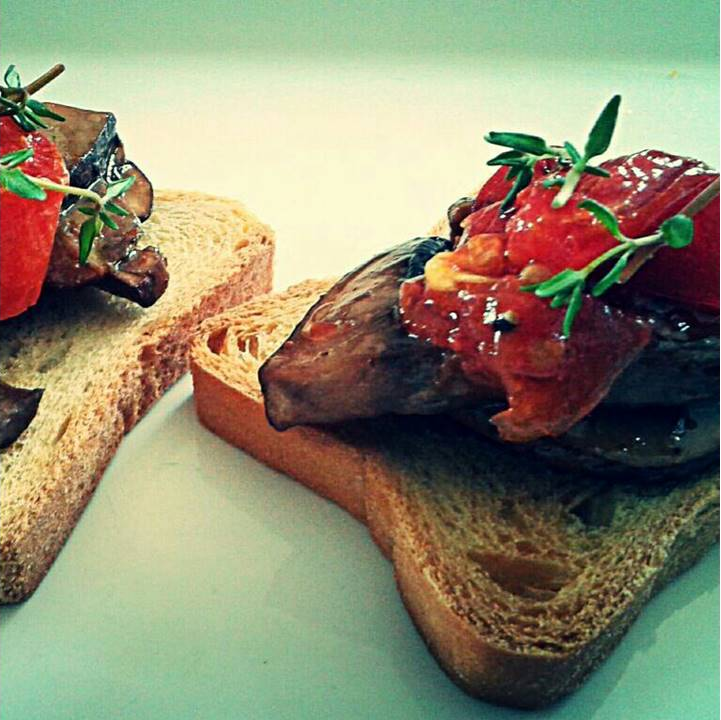

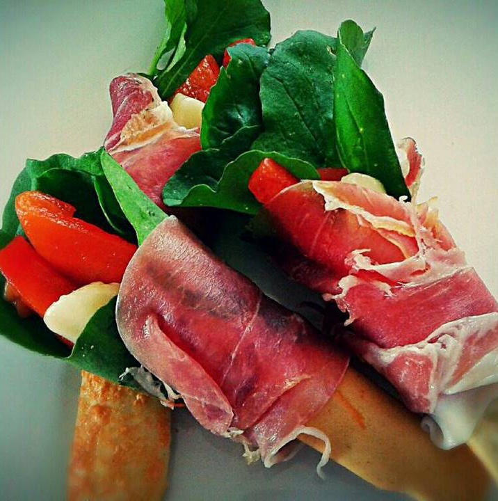
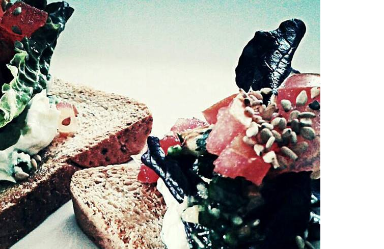
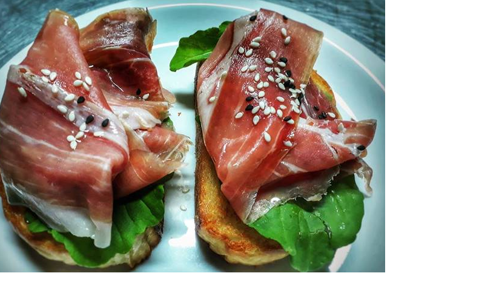

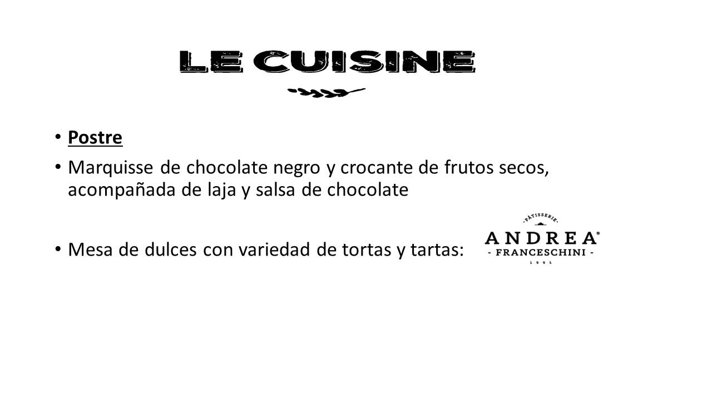

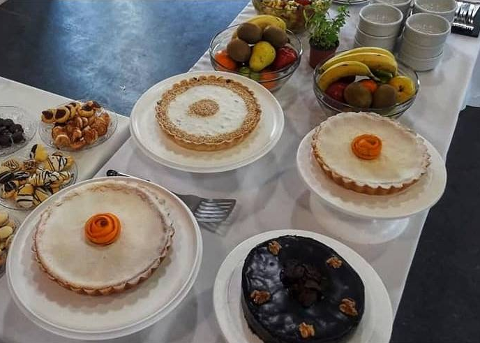

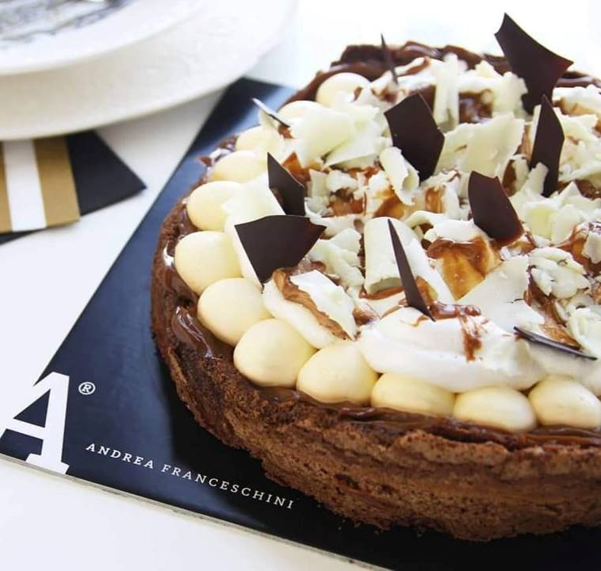

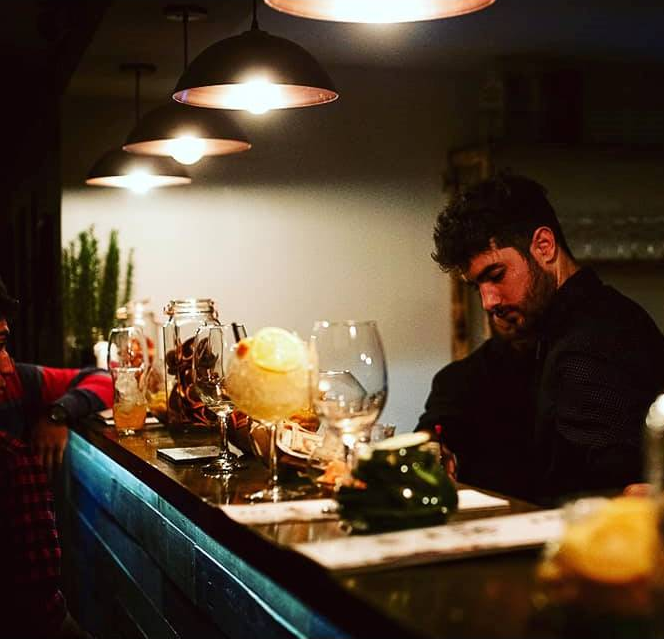

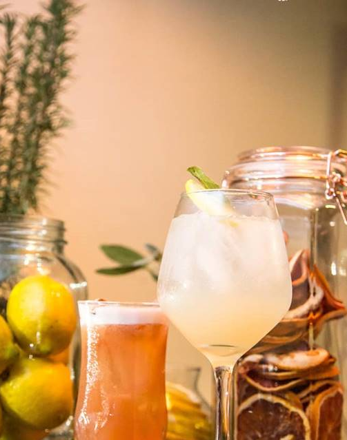
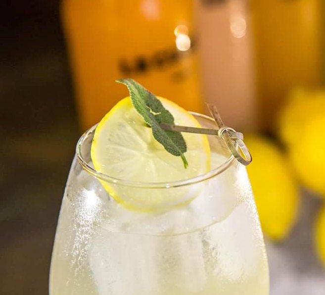

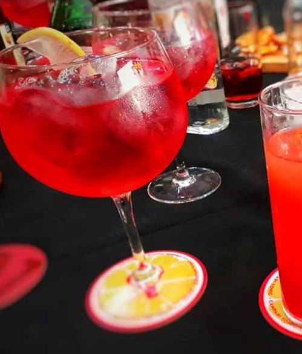

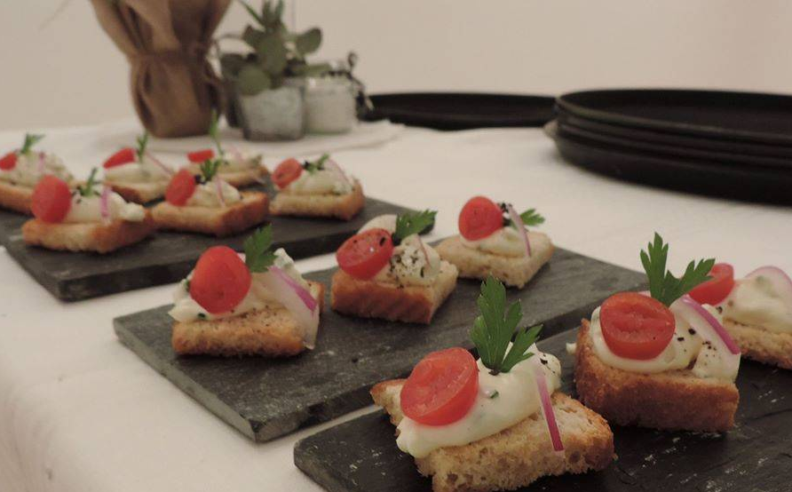
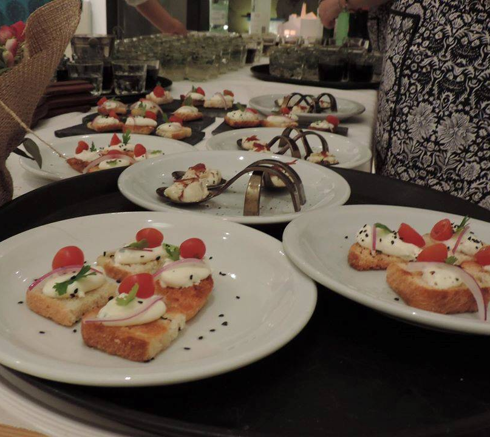

